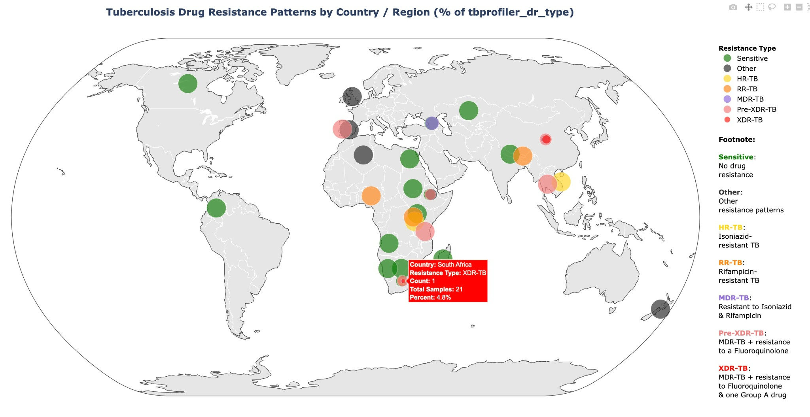

# TheiaProk AMR Visualizer

**TheiaProk AMR Visualizer** is a Python-based tool for analyzing and visualizing antimicrobial resistance (AMR) patterns using TSV outputs generated by Theiagen Public Health Bioinformatics workflows such as:

- `TheiaProk_Illumina_PE_PHB`
- `TheiaProk_Illumina_SE_PHB`
- `TheiaProk_ONT_PHB`

This scripts interrogate drug resistance  (e.g., for Tuberculosis) globally using outputs like `tbprofiler_dr_type` generated from `TheiaProk_Illumina_PE_PHB`,  `TheiaProk_Illumina_SE_PHB` and `TheiaProk_ONT_PHB`.

## Example Output



## Resistance Type (tbprofiler_dr_type)

- 🟢 **Sensitive** – No drug resistance  
- ⚫ **Other** – Resistance other than Isoniazid & Rifampicin   
- 🟡 **HR-TB** – Isoniazid-resistant TB  
- 🔵 **RR-TB** – Rifampicin-resistant TB  
- 🟣 **MDR-TB** – Resistant to Isoniazid & Rifampicin  
- 🟠 **Pre-XDR-TB** – MDR-TB + resistance to a Fluoroquinolone  
- 🔴 **XDR-TB** – MDR-TB + resistance to Fluoroquinolone & a Group A drug  

## How to Run

### 1. Install dependencies
```bash
pip install -r requirements.txt
```

### 2. Run the script
```bash
python /path/to/TheiaProk-amr-visualizer.py -i /path/to/Data_table.tsv
```

## Input Format

The script expects a TSV file with these required columns:
- `Country_of_sample_collection`
- `tbprofiler_dr_type`

The script will drop rows missing these fields and generate a bubble map of AMR types by country.

## Included Files

```
.
├── TheiaProk-amr-visualizer.py          # Main executable script
├── data/
│   └── demo_tb_data.tsv                 # Demo TSV input from 3 Theiagen workflows
├── images/
│   └── Tuberculosis_Drug_Resistance_Patterns.jpg
├── requirements.txt
└── README.md
```

## License

MIT License
